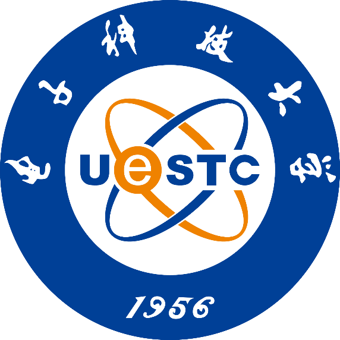

<div align=center>

</div>

# 面向低纹理场景的机器人鲁棒定位系统及算法研究

## 四个一
* 一个对标系统（[OpenVins](https://docs.openvins.com/index.html)）
* 一套代码（[OpenVins](https://github.com/rpng/open_vins/)+[GMS](https://github.com/JiawangBian/GMS-Feature-Matcher)+[MILD](https://github.com/lhanaf/MILD)）
* 一个文档（[文档](https://drive.google.com/?tab=ro&authuser=0)）
* 一个系统/论文(论文)

## 研究内容
* 基于间接特征匹配的前端特征跟踪算法研究。
  * [ORB特征点均匀化](https://blog.csdn.net/djfjkj52/article/details/115173349)
* 基于运动信息的重复纹理误匹配滤除算法研究
  * [四阶龙格库塔积分](https://zhuanlan.zhihu.com/p/107032156)
* 基于多索引哈希表的低纹理回环检测方法研究


## 目录
- [摘要](#摘要)
- [ABSTRACT](#ABSTRACT)
- [研究背景](#研究背景)
- [GMS算法的改进和优化](#GMS算法的改进和优化)
- [特征置信度的优化](#特征置信度的优化)
- [重复纹理的回环检测](#重复纹理的回环检测)
- [系统和实验](#系统和实验) 
- [总结和展望](#总结和展望)
- [致谢](#致谢)

<!-- <div align=center>

</div> -->


<div align=center>

</div>


## 摘要
```
论文研究内容

关键词：视觉SLAM  低纹理场景 卡尔曼滤波 简介匹配策略 重复纹理 回环检测

```

## ABSTRACT

```
something about this paper

Keywords: thing1, thing2, thing3
```
## 研究背景

<div align="right">
    <b><a href="#目录">↥ Back To Top</a></b>
</div>


## GMS算法的改进和优化
### 参考论文
```
[1] Geneva P, Eckenhoff K, Lee W, et al. Openvins: A research platform for visual-inertial estimation[C]//2020 IEEE International Conference on Robotics and Automation (ICRA). IEEE, 2020: 4666-4672.
[2] Bian J W, Lin W Y, Matsushita Y, et al. Gms: Grid-based motion statistics for fast, ultra-robust feature correspondence[C]//Proceedings of the IEEE conference on computer vision and pattern recognition. 2017: 4181-4190.
```
### 理论推导

<div align="center">
 
  <br />
     <br /> <br />
  
</div>

<div align="right">
    <b><a href="#目录">↥ Back To Top</a></b>
</div>


## 特征置信度的优化
### 参考论文
```

```

### 理论推导
- 方差
<div align="center">
 
  <br />
  
</div>

- 协方差


<div align="center">
 
  <br />
    <br /><br />
  
</div>

- 相关系数

<div align="center">
 
  <br />
  
</div>

- 协方差矩阵

<div align="center">
 
  <br />
    <br /><br />
  
</div>

- 信息矩阵

<div align="center">
    <br />
</div>


<div align="right">
    <b><a href="#目录">↥ Back To Top</a></b>
</div>


## 重复纹理的回环检测


* [回环检测相关论文和调研](https://blog.csdn.net/qq_40679814?type=blog)

### 参考论文

```
[1] Han L, Fang L. MILD: Multi-index hashing for loop closure detection[J]. arXiv preprint arXiv:1702.08780, 2017.

[2] Han L, Zhou G, Xu L, et al. Beyond SIFT using binary features in loop closure detection[C]//2017 IEEE/RSJ International Conference on Intelligent Robots and Systems (IROS). IEEE, 2017: 4057-4063.

[3] Jégou H, Douze M, Schmid C. On the burstiness of visual elements[C]//2009 IEEE conference on computer vision and pattern recognition. IEEE, 2009: 1169-1176.


```

重复纹理：
* 图像内：'纹理在图片内多次出现'
* 图像间：'相似的物品在多个地方重复出现'

文章揭示了图像集中存在大量多次出现的视觉元素，即重复模式。这样视觉元素会严重影响图像检索时的相似度计算，所以需要除去burstiness元素，文中提出了三种方法：

* 移去多次特征点匹配；
* 抑制图像内burstiness词的匹配得分；
* 抑制图像间burstiness词的匹配得分。
### 理论推导

<div align="right">
    <b><a href="#目录">↥ Back To Top</a></b>
</div>


## 系统和实验

- [openvins测试方法](https://blog.csdn.net/weixin_43793960/article/details/110929933)

        数据格式：# timestamp tx ty tz qx qy qz qw
- [特征匹配测试方法](https://github.com/JiawangBian/FM-Bench)
```
介绍系统
前端
后端
回环检测
实验结果
匹配效果对比
定位精度对比
回环准确率对比


```
<div align="right">
    <b><a href="#目录">↥ Back To Top</a></b>
</div>


## 总结和展望

```
总结自己的工作
有哪些优点，
有哪些不足
展望未来可能的研究

```
<div align="right">
    <b><a href="#目录">↥ Back To Top</a></b>
</div>


## 致谢
```
感叹时光飞逝
感谢someone1
感谢someone2
感谢someone3
感谢someone4
最后，。。。
```
<div align="right">
    <b><a href="#目录">↥ Back To Top</a></b>
</div>


