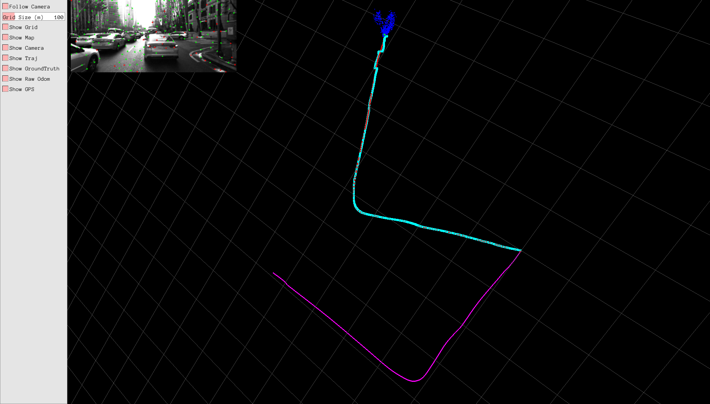
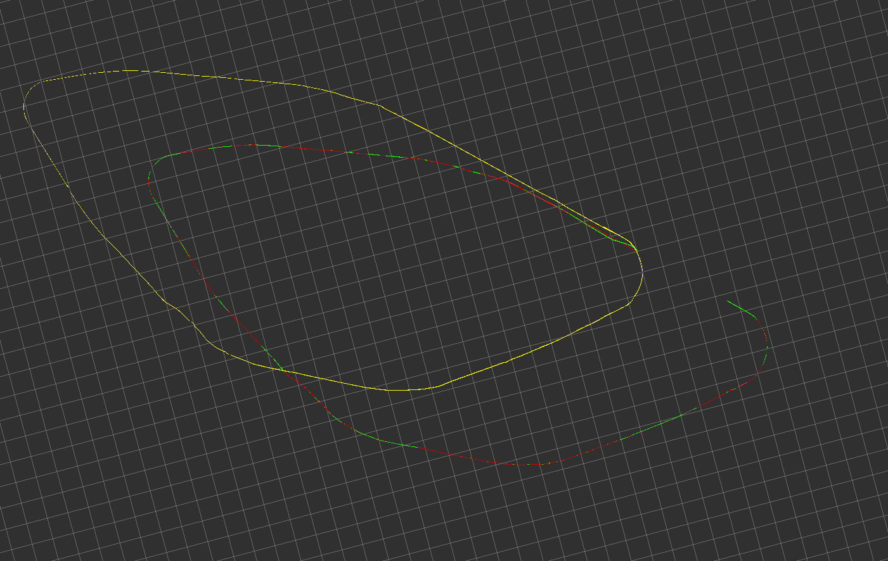
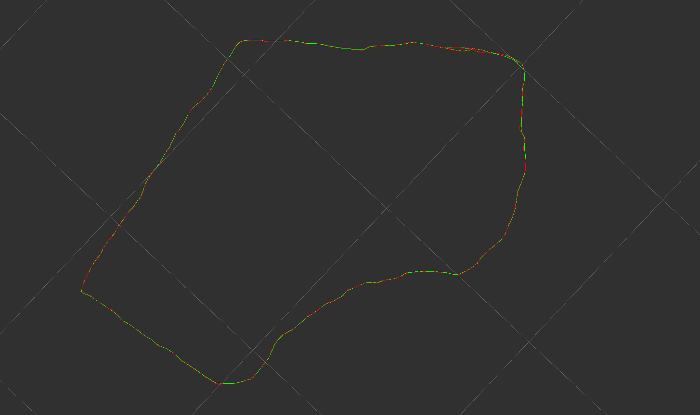

# Multi-Sensor-Fusion-Frameworks
开源的多传感器融合框架(GNSS, IMU, Camera, Lidar) 


#### TinyGrapeKit
轮速、视觉、GPS融合定位(https://zhuanlan.zhihu.com/p/330880853)


测试数据：KAIST Urban DataSet ([urban30](https://drive.google.com/drive/folders/1OizXFczlctIfFvfpw4R1klLDKJM-MznU?usp=sharing)  [urban22](https://drive.google.com/drive/folders/1iLfzg5Y66GN52komL22CISWVV6_T99O4?usp=sharing))

```
cd ~/TinyGrapeKit/app/FilterFusion/build
./RunKAISTData ~/TinyGrapeKit/app/FilterFusion/params/KAIST.yaml ~/kaist
```



#### imu_gps_encoder_msckf

IMU、GPS融合定位
测试数据：KAIST Urban DataSet([urban32](https://drive.google.com/drive/folders/1LCPxO7YKiv1-Kc477g1GRhyikdmgJEzR))

```
roslaunch read_kaist_dataset kaist.launch
```


#### imu_gps_localization

IMU、GPS融合定位
测试数据：https://drive.google.com/file/d/1S9M0gwNQ1rdXC7CPmH9ke0jbwOlopQpB/view?usp=sharing

```
roslaunch imu_gps_localization imu_gps_localization.launch
```
