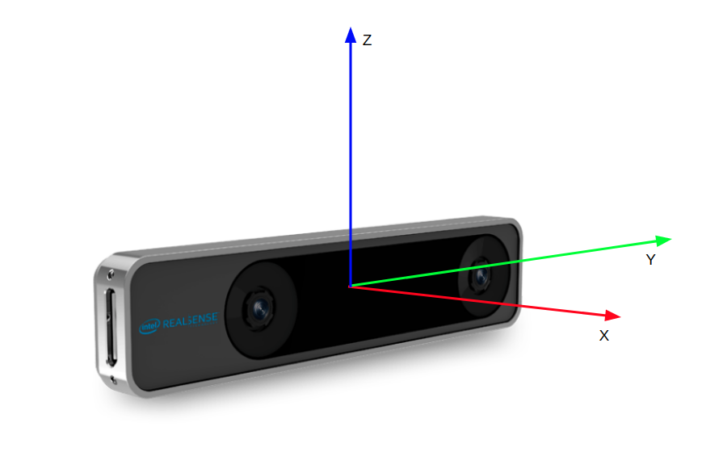

# gps_vio

A ROS package: GPS-aided VIO using a factor graph that fuses VIO from Realsense T265 and GPS from PX4

More technical details can be found on github repository [wiki](https://github.com/ZhiangChen/gps_vio/wiki)

## Installation
#### Dependences
1. Realsense SDK: [librealsense](https://github.com/IntelRealSense/librealsense/blob/development/doc/distribution_linux.md)
2. [realsense-ros](https://github.com/IntelRealSense/realsense-ros)
3. [gtsam](https://gtsam.org/get_started/): Install via PPA to avoid building from source. 
4. [catkin_simple](https://github.com/catkin/catkin_simple): Recommended. If you do not want to use catkin_simple, replace "CMakeLists.txt" with "CMakeLists(no catkin_simple).txt"
#### gps_vio
```
git clone https://github.com/ZhiangChen/gps_vio.git
cd ~\catkin_ws
catkin build gps_vio
```

## Getting Started
#### Gazebo
PX4 sitl has been used in Gazebo to simulate an aircraft with GPS. gps_vio subscribes to ```/mavros/odometry/in``` for fake VIO and to ```/mavros/global_position/local``` for GPS. First, launch a robot model with PX4 SITL. Note covariance matrices in both odometries are used to build factors, otherwise you need to define static covariance matrices in the parameter file ```param.cpp```. Then launch the node

```
roslaunch px4 mavros_posix_sitl.launch
roslaunch gps_vio gazebo_test.launch
```

#### Real world
We have Pixhawk 2 with an RTK GPS, an Intel NUC as a companion computer, and a Realsense T265 tracking camera connected with the Intel NUC. First, PX4 and Realsense T265 need to be launched on the Intel NUC
```
roslaunch px4 px4.launch
roslaunch realsense2_camera rs_t265.launch
```
We use the default camera configuration. If you want to change it, 
```
rosrun rqt_reconfigure rqt_reconfigure
```
Lastly, launch gps_vio
```
roslaunch gps_vio gps_vio.launch
```

## Factor Graph


## Tracking camera external calibration
PX4 and Realsense T265 have different coordinate systems. I use an [M-estimator or Robust Error Model](https://gtsam.org/2019/09/20/robust-noise-model.html) to estimate the transform betweem the T265 camera and the Pixhawk FCU. More information be can found on [the wiki](https://github.com/ZhiangChen/gps_vio/wiki/T265-External-Calibration). 

[PX4 coordinate system](https://dev.px4.io/v1.9.0/en/ros/external_position_estimation.html#ros_reference_frames)  
ENU(X East, Y North, and Z Up) has been used here.

[Realsense T265 coordinate system](https://github.com/IntelRealSense/librealsense/blob/master/doc/t265.md)  



